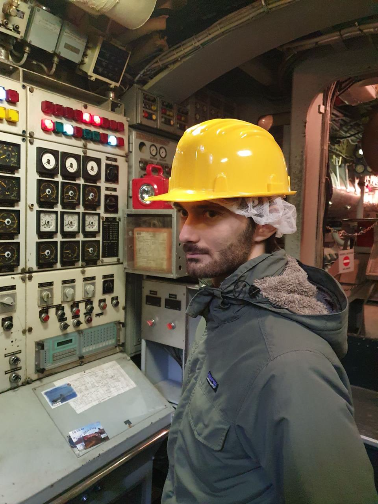

Hi!

I'm a PhD Student at [Politecnico di Milano](https://polimi.it) advised by  [Prof. Gianni Antichi](https://gianniantichi.github.io).

My research interests are in computer networks, specifically the design and implementation of network stacks and protocols for high-performance, low-latency applications. I am more broadly interested in operating systems and how they can be optimized for networking workloads.

I hold a Master's degree and a Bachelor's degree in Computer Science & Engineering from [Politecnico di Milano](https://www.polimi.it/en/).

You can find me on [GitHub](https://github.com/marcomole00), [Google Scholar](https://scholar.google.com/citations?user=YdEB6nQAAAAJ&hl=en)  and  [LinkedIn](https://www.linkedin.com/in/marco-mole/).

You can contact me at marco.mole at polimi.it

My cv is  [here](https://github.com/marcomole00/marcomole00.github.io/blob/master/curriculum-3.pdf)

## Publications
- [Don't Stall Me Now: Hiding Memory Latency in eBPF](https://conferences.sigcomm.org/sigcomm/2026/).  Farbod Shahinfar, **Marco Molè**, Aurojit Panda, Gianni Antichi @ SIGCOMM '26 *yet to appear*
- [Performance Implications at the Intersection of AF_XDP and Programmable NICs](https://dl.acm.org/doi/10.1145/3748355.3748359). **Marco Molè**, Farbod Shahinfar, Francesco Maria Tranquillo, Davide Zoni, Aurojit Panda, Gianni Antichi @ eBPF Workshop '25, colocated with SIGCOMM

## Open Source
- Contributed XDP support to the [OpenNIC](https://github.com/Xilinx/open-nic-driver) driver.

## Community Service
- Shadow PC CoNEXT '26

---

This is me doing engineering.
